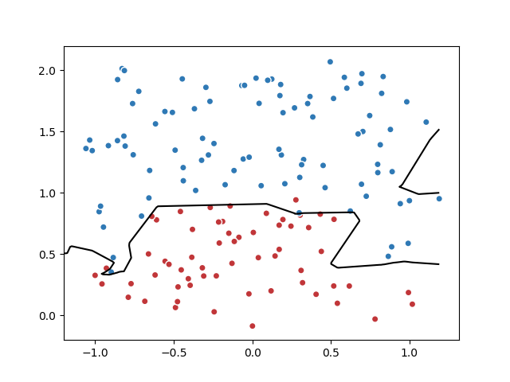

# 第四章 深层神经网络

在第三章介绍的神经网络中，都是线性模型，而深度学习的一大特点就是他是非线性的。
线性模型能够解决的问题是有限的，此时能够支持非线性模型就很重要。

## 激活函数去线性化

那么深度学习的去线性化解决方案就是在每一个节点是输出上，增加一个`非线性激活函数`以及`偏置项`进行过滤。有了这个非线性激活函数，那么整个神经网络就不再是线性模型了。
`book4.1.4-1.py`文件给出了加入了激活函数和偏置项的完整训练程序。

## 多层网络解决更深层次特征提取问题

异或问题是神经网络发展史上一个重要的问题。对于没有隐藏层的神经网络，是没有办法解决异或问题的。

但是一旦加上隐藏层后，通过隐藏层的可以抽取输入层更高维度的特征。这点很重要。详见P74

## 损失函数

神经网络模型的效果和优化的目标是通过`损失函数（loss function）`来定义的。
`交叉熵`刻画了两个概率分布之间的距离，他是分类问题中比较常用的一种损失函数。详见P75

### 自定义损失函数

通过`tf.where`函数完成选择操作，`tf.greater`函数来比较张量中每个元素的大小。

## 神经网络优化算法

整个神经网络优化算法可以抽象为，寻找一个参数，使得损失函数值最小。

`梯度下降算法`和`学习率`，梯度为损失函数的偏导（可以理解为函数当前点的斜率），学习率可以定义每次更新的幅度。Page83有具体示例。

## 神经网络的训练大致遵循以下过程

### 整个神经网络的优化过程氛围两个阶段：

1. 通过前向传播算法计算得到`预测值`，并将预测值和真实值做对比得到两者差距(损失函数)。
2. 通过反向传播算法计算损失函数会每一个参数的 `梯度` ,再根据梯度和 `学习率` 使用 `梯度下降算法` 更新每一个参数。

更具体的说，梯度下降算法主要用于优化单个参数的取值，而反向传播算法给出了一个高效的方式在所有参数上使用梯度下降算法，从而使神经网络模型在训练数据上的损失函数尽可能更小。

### 过拟合问题

在模型训练中，直接使用损失函数可能会存在 `过拟合问题` ，就是说过度关注于训练数据中的噪音，不能很好的对未来数据做出判断。
因此为了避免过拟合问题，常常会将损失函数 `正则化` 。具体可见Page88。
程序 `book4.4.2-1` 和 `book4.4.2-2` 分别给出了完整的正则化训练过程和单独正则化函数的程序。

程序 `book4.4.2-3` 给出了使用了 `集合` 的完成的损失函数正则化训练过程，并通过生成对比图给出了正则化和非正则化的损失函数的训练结果的不同。

训练结果图如下：

- 未正则化的损失函数训练结果↑

- 正则化的损失函数训练结果↑

## 神经网络训练大致步骤

在程序中大致有以下步骤：

1. 每次读取小部分驯良数据执行反向传播算法

2. 定义神经网络结构和优化算法

3. 训练神经网络，包括：
    
    - 参数初始化
    - 迭代更新参数
